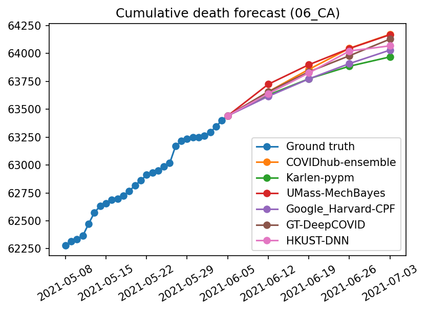
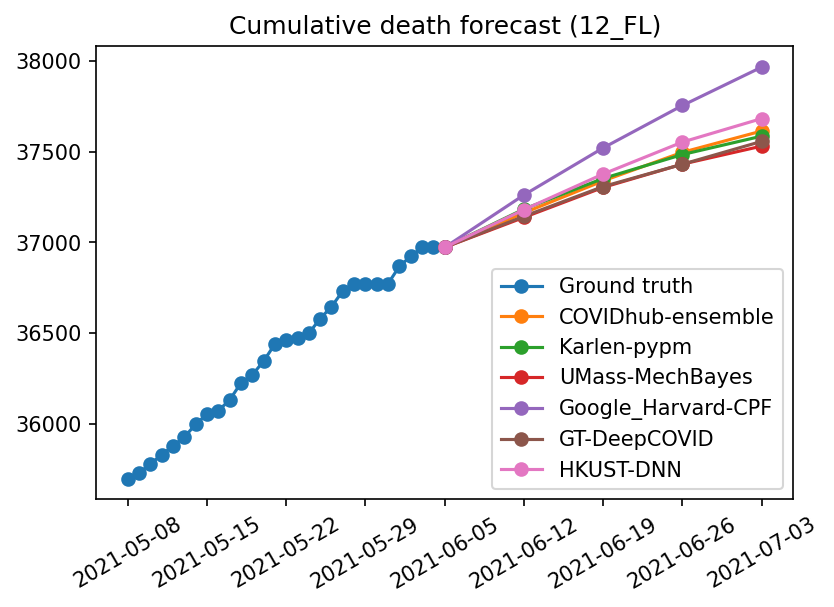
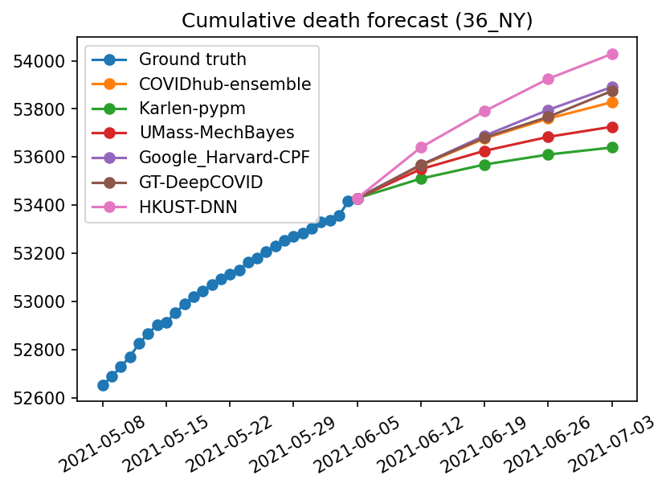
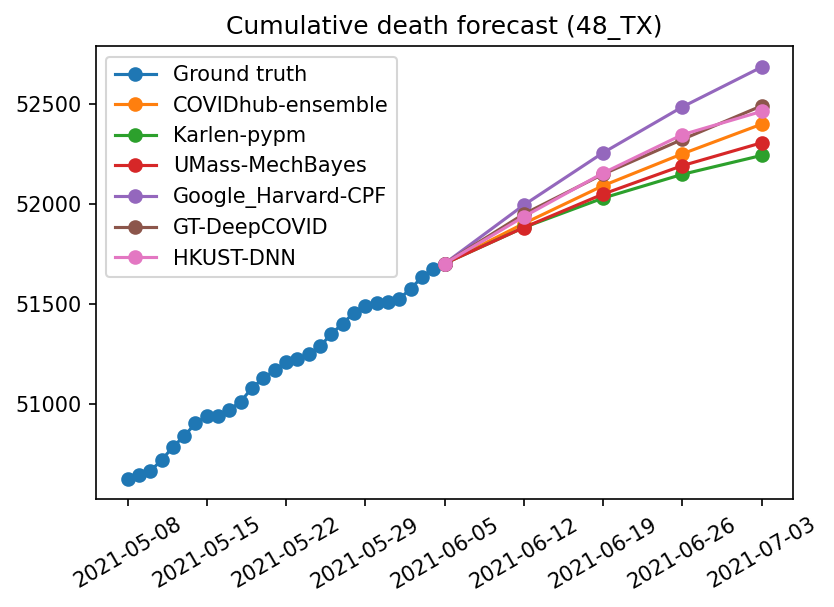

## About
HKUST-DNN forecasts the trends of COVID-19 at the state level using deep neural networks. Based on observations of deaths, cases, and hospitalization data \[<a href="#data-source">1</a>, <a href="#data-source">2</a>\] since the outbreak in early 2020, our deep neural networks are trained to forecast state-level cumulative deaths in the United States.

## Latest state-level forecast
(updated on 2021-06-07)

   

[more results](results.md)

## Contact
<a href="mailto:fcy@cse.ust.hk">Chung-Yan FONG</a> and <a href="http://home.cse.ust.hk/~dyyeung">Professor Dit-Yan YEUNG</a>  
Department of Computer Science and Engineering  
The Hong Kong University of Science and Technology

## Data source
\[1\] <a href="https://github.com/CSSEGISandData/COVID-19" target="_blank">https://github.com/CSSEGISandData/COVID-19</a>  
\[2\] <a href="https://github.com/GoogleCloudPlatform/covid-19-open-data" target="_blank">https://github.com/GoogleCloudPlatform/covid-19-open-data</a>
